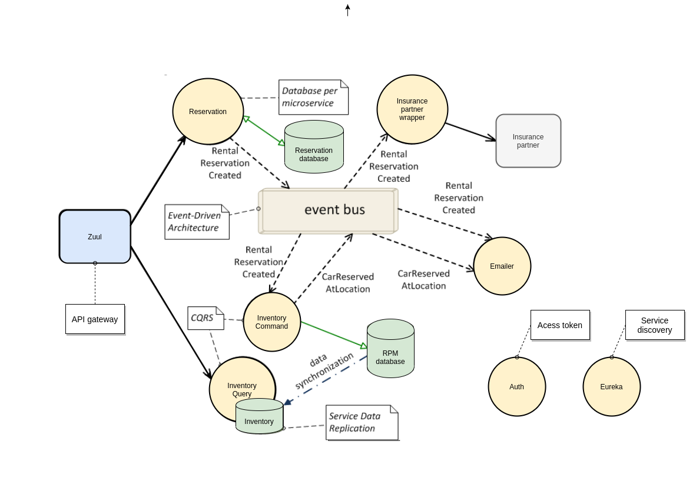

This is the Kotlin version to search for rental cars and make reservations, example that I've used to presentation
on developing microservices.

This application demonstrates the patterns:

* [Event-driven](https://microservices.io/patterns/data/event-driven-architecture.html) - some business transactions, however, span multiple service so you need a mechanism to ensure data consistency across services.
* [Database per service](https://microservices.io/patterns/data/database-per-service.html) - each service has its own private database.
* [CQRS](http://microservices.io/patterns/data/cqrs.html) - implement queries by maintaining one or more materialized views that can be efficiently queried.
* [Event sourcing](https://microservices.io/patterns/data/event-sourcing.html) - persist aggregates as a sequence of events.
* [Shared database](https://microservices.io/patterns/data/shared-database.html) - services share a database.
* [API gateway](https://microservices.io/patterns/apigateway.html) - a service that provides each client with unified interface to services.
* [Circuit Breaker](https://microservices.io/patterns/reliability/circuit-breaker.html) - invoke a remote service via a proxy that fails immediately when the failure rate of the remote call exceeds a threshold.
* [Access Token](https://microservices.io/patterns/security/access-token.html) - a token that securely stores information about user that is exchanged between services.
* [Distributed tracing](https://microservices.io/patterns/observability/distributed-tracing.html) - instrument services with code that assigns each external request an unique identifier that is passed between services. Record information (e.g. start time, end time) about the work (e.g. service requests) performed when handling the external request in a centralized service.
* [Exception tracking](https://microservices.io/patterns/observability/exception-tracking.html) - report all exceptions to a centralized exception tracking service that aggregates and tracks exceptions and notifies developers.
* [Health check API](https://microservices.io/patterns/observability/health-check-api.html) - service API (e.g. HTTP endpoint) that returns the health of the service and can be pinged, for example, by a monitoring service.

## Architecture

The following diagram shows the architecture of the Rental Cars application.

The application consists in the services: `API Gateway`, `Auth Service`, `Reservation Service`, `Inventory Command Service`, `Inventory Query Service`, `Emailer Service`, and `Insurance Partner Wrapper Service`.

All services are implemented using Spring Boot.